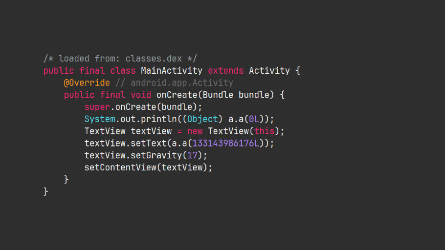
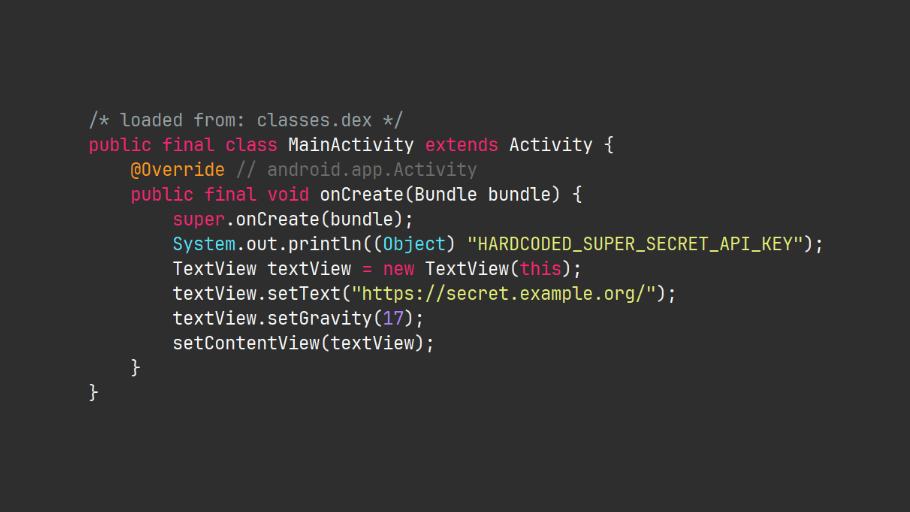

# Paranoid/LSParanoid deobfuscator

[](https://pypi.org/project/paranoid-deobfuscator)

<!--
> [!WARNING]
> Currently not working on Windows. Please use WSL or a Linux VM. See [#14](https://github.com/giacomoferretti/paranoid-deobfuscator/issues/14).
-->
> [!NOTE]
> Only compatible with Paranoid v0.3.0+ (released in 25 Jan 2020)
>

A script to deobfuscate apps obfuscated with [Paranoid]/[LSParanoid] to help you with static analysis.

|            Before             |            After            |
| :---------------------------: | :-------------------------: |
|  |  |

## Installation

### Using pip

`pip install paranoid-deobfuscator`

### Using pipx

`pipx install paranoid-deobfuscator`

<!-- ### Manual

1. `git clone https://github.com/giacomoferretti/paranoid-deobfuscator`
2. `cd paranoid-deobfuscator`
3. `pip install .` -->

## Usage


```text
$ paranoid-deobfuscator --help

Usage: paranoid-deobfuscator [OPTIONS] COMMAND [ARGS]...

Options:
  -v, --verbose  Enables verbose mode
  --help         Show this message and exit.

Commands:
  deobfuscate  Deobfuscate a paranoid obfuscated APK smali files
  helpers      Helper commands
```

```text
$ paranoid-deobfuscator deobfuscate --help

Usage: paranoid-deobfuscator deobfuscate [OPTIONS] TARGET

  Deobfuscate a paranoid obfuscated APK smali files

Options:
  --help  Show this message and exit.
```

```text
$ paranoid-deobfuscator helpers --help

Usage: paranoid-deobfuscator helpers [OPTIONS] COMMAND [ARGS]...

  Helper commands

Options:
  --help  Show this message and exit.

Commands:
  deobfuscate-string  Deobfuscate a string using extracted chunks
  extract-chunks      Save the chunks from a paranoid obfuscated APK
  extract-strings     Extracts the strings from a paranoid obfuscated APK
```

### APK file (using [Apktool])

1. Decode `.apk` file: `apktool d app.apk`
2. Run deobfuscator: `paranoid-deobfuscator deobfuscate app` <!-- `paranoid-deobfuscator app` (or `python -m paranoid_deobfuscator app`) -->
3. Build: `apktool b app`
<!-- 4. Enjoy your deobfuscated apk! -->

### DEX file (using [smali])

1. Disassemble `.dex` file: `baksmali d classes.dex`
2. Run deobfuscator: `paranoid-deobfuscator deobfuscate out` <!-- `paranoid-deobfuscator out` (or `python -m paranoid_deobfuscator out`) -->
3. Assemble: `smali a out`
<!-- 4. Enjoy your deobfuscated dex! -->

[paranoid]: https://github.com/MichaelRocks/paranoid
[lsparanoid]: https://github.com/LSPosed/LSParanoid
[apktool]: https://github.com/iBotPeaches/Apktool
[smali]: https://github.com/google/smali
