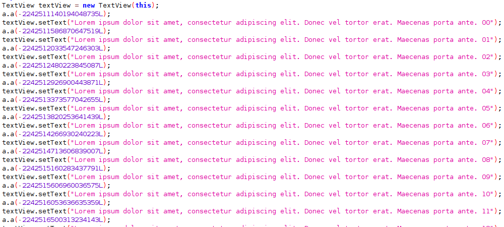

# Paranoid/LSParanoid deobfuscator

A script to deobfuscate apps obfuscated with [Paranoid]/[LSParanoid] to help you with static analysis.

NOTE: Only compatible with Paranoid v0.3.0+ (released in 25 Jan 2020)

|            Before             |            After            |
| :---------------------------: | :-------------------------: |
|  |  |

## Installation

<!-- `pip install paranoid-deobfuscator` SOON -->

`python setup.py install`

## Requirements

- Python 3
  - `numpy` package (install it via `pip install numpy` or `pip install -r requirements.txt`)

## Usage

### APK file (using [Apktool])

1. Decode `.apk` file: `apktool d app.apk`
2. Run deobfuscator: `python -m paranoid_deobfuscator app` <!-- `paranoid-deobfuscator app` (or `python -m paranoid_deobfuscator app`) -->
3. Build: `apktool b app`
4. Enjoy your deobfuscated apk!

### DEX file (using [smali])

1. Disassemble `.dex` file: `baksmali d classes.dex`
2. Run deobfuscator: `python -m paranoid_deobfuscator out` <!-- `paranoid-deobfuscator out` (or `python -m paranoid_deobfuscator out`) -->
3. Assemble: `smali a out`
4. Enjoy your deobfuscated dex!

[paranoid]: https://github.com/MichaelRocks/paranoid
[lsparanoid]: https://github.com/LSPosed/LSParanoid
[apktool]: https://github.com/iBotPeaches/Apktool
[smali]: https://github.com/google/smali
